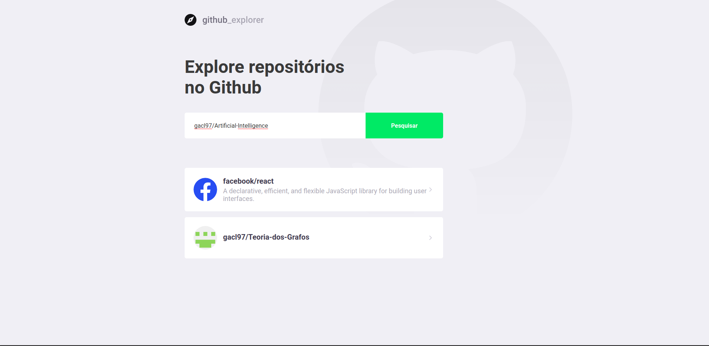
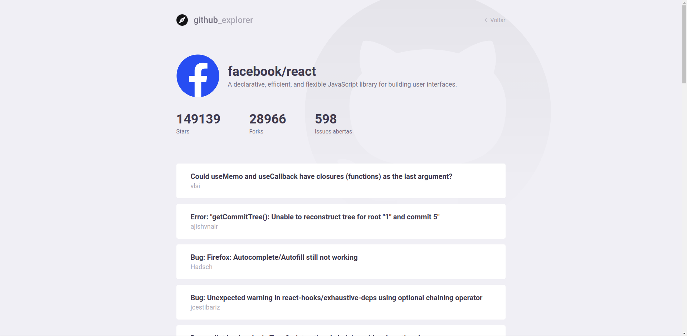

 

  

  <strong>Projeto para explorar repositorios do Github, feito com React JS</strong>

  

  
  
  
  
  
  
  

  

## Recursos

  * Adicionar repositórios a lista
  * Ver forks do repositório
  * Ver forks do repositório
  * Ver stars do repositório
  * Ver issues do repositório

  

  

  

## Instalando o projeto

  Clonando o repositório:

    git clone https://github.com/gacl97/Github-Explorer.git
  
  Instalando as dependências:

    yarn install
  
  Iniciar a aplicação:

    yarn start
